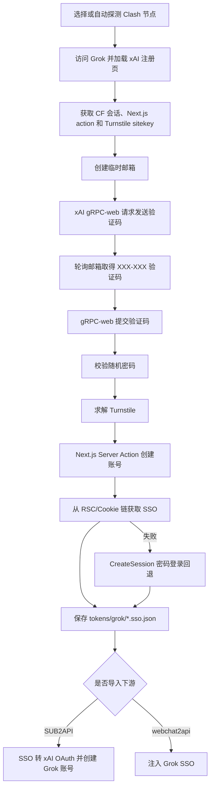

# reg-factory 项目说明与接口清单

当前 CO0kie 改写版本：`26.7.21A`

本文档面向项目接手、二次开发和接口排查。它说明这个仓库在做什么、核心流程如何串联，以及项目暴露了哪些命令行、HTTP、本地适配和文件接口。

使用范围说明：本项目包含邮箱、账号注册、验证码处理、短信接码、浏览器指纹和代理切换等自动化能力。运行前应确认用途符合目标服务条款、授权范围和本地法律要求。仓库通过 `.env`/环境变量读取密钥，代码库不应提交真实凭据。

## 1. 项目在做什么

`reg-factory` 是一个 Python 自动化流水线项目。它的目标是把邮箱供给、目标平台注册、登录态导出和下游系统导入串起来，形成可由 CLI 或本地 Web 面板驱动的注册/授权工作流。

核心链路可以概括为：

1. 生成或导入邮箱资源。
   - Outlook：通过浏览器自动化注册，写入 `emails.txt` 和 `_outlook_pool/`。
   - Gmail：通过 Android 模拟器、Appium 和 Gmail App 驱动本地注册流程，默认在手机/安全验证处停住交给操作者处理。
2. 使用邮箱在目标平台注册。
   - 当前主要脚本覆盖 Claude、ChatGPT、Grok、GitHub。
   - 多平台注册可顺序或并行运行，并可通过共享取码服务避免同一个 Outlook 邮箱被多个浏览器会话同时登录。
3. 保存账号登录态。
   - Cookie 输出到 `cookies/`。
   - 标准 token 输出到 `tokens/`，例如 ChatGPT session、CPA codex JSON、chatgpt2api 导入对象、Grok SSO。
4. 可选导入下游系统。
   - ChatGPT/Codex：SUB2API、CPA、chatgpt2api。
   - Grok：SUB2API Grok OAuth、webchat2api。
5. 提供本地 WebUI。
   - WebUI 读取脚本 schema 自动渲染表单，提交后以子进程运行脚本，并通过 SSE 推送日志。

## 2. 主要目录和职责

| 路径 | 职责 |
|---|---|
| `README.md` | 面向使用者的安装、配置、运行说明。 |
| `.env.example` | 环境变量模板，覆盖代理、指纹浏览器、接码、打码、上传目标、视觉网关等配置。 |
| `config.py` | 全局配置入口，加载 `.env`，并把环境变量映射成 Python 常量。 |
| `webui/` | 本地 FastAPI 控制面板，含前端静态页和脚本/配置 schema。 |
| `common/` | 可复用基础能力：浏览器连接、邮箱取码、短信接码、代理切换、token 转换、上传器等。 |
| `outlook/` | Outlook 子项目：Graph 邮箱元数据、aiohttp 邮箱工作台、模块文档和运行时目录。 |
| `gmail_android/` | Gmail Android/Appium 本地自动化模块和安装脚本。 |
| `vision_solver/` | 通用视觉验证码求解器，使用多模态模型投票和 Playwright driver。 |
| `co0kie_grok/` | CO0kie 整理的上游 Grok 知识库，覆盖 HTTP/浏览器注册、临时邮箱、Turnstile、SSO、OAuth 和下游导入。 |
| `assets/` | 说明图、二维码、GitHub 验证截图示例等静态资源。 |
| `cookies/` | 运行时 cookie 输出目录，仓库只保留 `.gitkeep`。 |
| `tokens/` | 运行时 token 输出目录，仓库只保留 `.gitkeep`。 |
| `screenshots*` | 运行、验证码和调试截图输出目录。 |
| `tri_register_logs/` | 三平台注册编排脚本的子进程日志。 |
| `_outlook_pool/` | Outlook 邮箱生产池相关运行时文件。 |

## 3. 核心运行流程

### 3.1 端到端流程

入口：`run_full_flow.py`

流程：

1. Stage A 启动 `outlook_reg_loop.py` 注册 Outlook 邮箱。
2. 监听 `emails.txt`，发现新邮箱后停止邮箱生产子进程。
3. Stage B 调用 `register_three_platforms.py`，用该邮箱注册指定平台。
4. 下游平台脚本保存 cookies/tokens，并按参数可选触发导入。

常见调用：

```bash
python run_full_flow.py
python run_full_flow.py --platforms claude chatgpt grok
python run_full_flow.py --platforms chatgpt --import-c2a
python run_full_flow.py --skip-email --email a@outlook.com --password xxx
python run_full_flow.py --dry-run
```

关键参数：

| 参数 | 说明 |
|---|---|
| `--platforms claude chatgpt grok` | 选择要注册的平台。 |
| `--rounds` | 循环轮数，`0` 表示无限循环。 |
| `--skip-email` | 跳过 Outlook 注册，直接使用指定邮箱。 |
| `--broker` | 指定共享取码服务 URL。 |
| `--import-c2a` | ChatGPT 注册后导入 chatgpt2api。 |
| `--codex` | ChatGPT 注册后走 Codex OAuth，生成可续期凭据并导入 SUB2API。 |
| `--proxy` / `--clash-*` | 给子进程注入 Clash 代理和控制面配置。 |

### 3.2 已有邮箱注册多平台

入口：`register_three_platforms.py`

职责：把一个邮箱账号分发到 Claude、ChatGPT、Grok 注册脚本。可从 `emails.txt` 取号，也可直接指定邮箱。默认顺序执行，`--parallel` 可并行。

常见调用：

```bash
python register_three_platforms.py --from-pool
python register_three_platforms.py --email a@outlook.com --password xxx --token REFRESH --client-id CID
python register_three_platforms.py --from-pool --platforms claude chatgpt grok
python register_three_platforms.py --loop --max-inflight 1
```

关键点：

- 子脚本日志写入 `tri_register_logs/`。
- 默认 broker 为 `http://127.0.0.1:8765`。
- `--broker ""` 可禁用共享取码。
- `--codex`、`--import-c2a` 会透传给 ChatGPT 注册脚本。

### 3.3 Outlook 邮箱生产和维护

主要入口：

| 脚本 | 作用 |
|---|---|
| `outlook_reg_loop.py` | 循环注册 Outlook，输出到 `_outlook_pool/` 和 `emails.txt`。 |
| `register_outlook_standalone.py` | 独立 Outlook 注册脚本，支持代理文件、多模式和验证回退。 |
| `unlock_outlook.py` | 批量解锁被锁 Outlook，结果输出到 `unlock_results/`。 |
| `extract_graph_tokens.py` | 用账号密码提取 Microsoft Graph refresh token，输出到 `outlook_accounts/`。 |
| `mailbox_broker.py` | 常驻共享取码服务，避免多窗口同时登录同一 Outlook。 |

`emails.txt` 格式：

```text
email----password----refresh_token----client_id
```

后两列可为空。`common/emails.py` 会按平台维护占用记录：

```text
emails_used_<platform>.txt
emails_error_<platform>.txt
```

### 3.4 单平台注册入口

| 脚本 | 平台 | 主要用途 |
|---|---|---|
| `register.py` | Claude | Claude 账号注册，支持指定邮箱、邮箱池、Clash 节点、短信接码。 |
| `register_chatgpt.py` | ChatGPT | ChatGPT 账号注册，保存 session/cookie，可导入 chatgpt2api 或继续 Codex OAuth。 |
| `register_grok.py` | Grok | Grok 账号注册，支持 Clash 节点探测，保存 Grok SSO。 |
| `register_github.py` | GitHub | GitHub 注册，包含 Arkose/FunCaptcha 相关视觉求解或打码回退。 |

常见参数模式：

```bash
python register.py --count 1 --email a@outlook.com --password xxx --token REFRESH --node auto
python register_chatgpt.py --count 1 --email a@outlook.com --password xxx --refresh-token REFRESH
python register_chatgpt.py --count 1 --import-c2a
python register_chatgpt.py --count 1 --codex --codex-group codex
python register_grok.py --count 1 --node auto
python register_github.py --auto --email a@x.com --password xxx
```

### 3.5 Grok 纯 HTTP 注册流程

当前 WebUI、三平台编排和端到端编排中的 Grok 主入口为 `register_grok_http.py`。它使用 `curl_cffi` 浏览器指纹和 `xconsole_client` 协议客户端完成注册，不启动真实浏览器。`register_grok.py` 浏览器实现继续保留，用于 Outlook 邮箱、页面调试和协议回退等兼容场景。



关键阶段：

1. `proxy_switch.find_working_node()` 探测能够完整加载 xAI Next.js 注册页面的节点。
2. `XConsoleAuthClient.visit_home()` 和 `load_signup_page()` 建立会话并提取动态注册参数。
3. `common.temp_email.create_mailbox()` 按 `TEMP_EMAIL_PROVIDER` 创建临时邮箱，支持逗号分隔的 provider 故障转移。
4. `create_email_validation_code()` 请求发码；邮箱域名被拒或收信超时后自动换邮箱。
5. `verify_email_validation_code()` 先提交原始 `XXX-XXX`，失败后去除分隔符重试，避开浏览器掩码输入框问题。
6. Turnstile 按 YesCaptcha、CapSolver、EZCaptcha 顺序求解。
7. `create_account()` 通过 Next.js server action 建号，随后从 RSC、Cookie 或密码登录回退中取得 SSO。
8. `save_grok_token()` 将 `{email, sso, ts}` 写入 `tokens/grok/`。
9. 使用 `--sub2api` 时调用 SUB2API SSO 转 OAuth 接口；远端转换失败时可经本机 Clash 代理执行 xAI Device Flow。

常见调用：

```bash
python register_grok_http.py --count 1 --node auto
python register_grok_http.py --count 5 --provider yyds,gptmail --rotate-every 5
python register_grok_http.py --count 1 --sub2api --sub2api-group grok
python upload_tokens.py grok
```

完整分析见 [`co0kie_grok/README.md`](co0kie_grok/README.md)。

## 4. 本地 WebUI 接口

入口：

```bash
python -m uvicorn webui.server:app --host 127.0.0.1 --port 8799
```

或：

```bash
start.bat
./start.sh
```

WebUI 只绑定本机地址，后端文件为 `webui/server.py`，前端文件在 `webui/static/`。脚本和配置表单 schema 来自 `webui/scripts.py`。

### 4.1 WebUI HTTP API

| 方法 | 路径 | 作用 |
|---|---|---|
| `GET` | `/` | 返回前端页面。 |
| `GET` | `/api/status` | 返回指纹浏览器、Clash、当前节点、运行任务数。 |
| `GET` | `/api/scripts` | 返回可运行脚本 schema。 |
| `GET` | `/api/links` | 返回外部工具链接 schema。当前为空。 |
| `GET` | `/api/embeds` | 返回内嵌工具页 schema。当前包含 Gmail 在线页配置。 |
| `GET` | `/api/env` | 返回 `.env` 配置 schema 和当前值。 |
| `POST` | `/api/env` | 保存允许列表内的 `.env` 配置项。首次保存会从 `.env.example` 复制。 |
| `POST` | `/api/test/{target}` | 连通性测试，`target` 支持 `clash`、`bitbrowser`、`smsman`、`firefox`。 |
| `GET` | `/api/mailpool` | 返回 `emails.txt` 中邮箱数量。 |
| `POST` | `/api/mailpool` | 批量导入邮箱到 `emails.txt`，会去重和校验格式。 |
| `POST` | `/api/run` | 根据脚本 ID 和参数启动子进程，返回 `run_id` 和命令。 |
| `GET` | `/api/logs/{run_id}` | 以 Server-Sent Events 推送子进程日志。 |
| `POST` | `/api/stop/{run_id}` | 终止指定运行任务。 |
| `POST` | `/api/sms/rent` | 使用 sms-man 租号，服务名默认取 Gmail/Google。 |
| `POST` | `/api/sms/code` | 查询某个租号的新验证码。 |
| `POST` | `/api/sms/release` | 释放某个租号。 |
| `GET` | `/api/sms/rents` | 返回当前内存中的租号状态。 |

`POST /api/run` 请求体示例：

```json
{
  "script": "run_full_flow",
  "args": {
    "--platforms": ["claude", "chatgpt"],
    "--rounds": 1,
    "--dry-run": true
  }
}
```

返回示例：

```json
{
  "run_id": "r1",
  "cmd": "python -u D:\\...\\run_full_flow.py --platforms claude chatgpt --rounds 1 --dry-run"
}
```

### 4.2 WebUI 暴露的脚本 schema

这些脚本都可以从面板运行，schema 位于 `webui/scripts.py`。

| ID | 文件 | 分类 | 说明 |
|---|---|---|---|
| `run_full_flow` | `run_full_flow.py` | 主流程 | Outlook 注册加平台注册端到端流程。 |
| `register_three_platforms` | `register_three_platforms.py` | 主流程 | 用已有邮箱注册 Claude/ChatGPT/Grok。 |
| `oauth_codex` | `oauth_codex.py` | 主流程 | 用已保存 ChatGPT cookie 走 Codex OAuth，导入 SUB2API/CPA。 |
| `register_chatgpt` | `register_chatgpt.py` | 单平台注册 | ChatGPT 注册。 |
| `register_grok` | `register_grok.py` | 单平台注册 | Grok 注册。 |
| `register_claude` | `register.py` | 单平台注册 | Claude 注册。 |
| `register_github` | `register_github.py` | 单平台注册 | GitHub 注册。 |
| `outlook_reg_loop` | `outlook_reg_loop.py` | 养号/邮箱 | Outlook 自注册生产池。 |
| `unlock_outlook` | `unlock_outlook.py` | 养号/邮箱 | Outlook 解锁。 |
| `extract_graph_tokens` | `extract_graph_tokens.py` | 养号/邮箱 | 提取 Microsoft Graph refresh token。 |
| `mailbox_broker` | `mailbox_broker.py` | 养号/邮箱 | 共享取码服务。 |
| `upload_tokens` | `upload_tokens.py` | 导出/上传 | 上传标准 token 到下游。 |
| `export_chatgpt2api` | `export_chatgpt2api.py` | 导出/上传 | 聚合/上传 ChatGPT 普通网页号。 |
| `export_accounts` | `export_accounts.py` | 导出/上传 | 导出 cookies 为扩展可用账号文件。 |

### 4.3 Outlook 本地邮箱服务

入口：

```powershell
D:\0Code2\py312\python.exe outlook/server/main.py --host 127.0.0.1 --port 8780
```

该服务和主 WebUI、共享取码 broker 相互独立。它使用
`graph_refresh_token/out/*.txt` 作为账号源，通过 Microsoft Graph 展示邮箱文件夹、邮件标题和收件地址元数据。

登录规则：

- 普通会话使用账号文件中的邮箱和密码，只能访问自身邮箱。
- 原始 `Host` 和客户端 IP 同时为 `127.0.0.1` 时，本机免密会话可访问全部邮箱。
- 不信任代理身份头；本机全邮箱会话在 Host/IP 改变时立即失效。

主要接口：

| 方法 | 路径 | 作用 |
|---|---|---|
| `GET` | `/health` | 返回服务名、`26.7.12A` 版本、时间和账号目录状态。 |
| `GET` | `/api/accounts` | 返回当前会话可访问的邮箱列表。 |
| `GET` | `/api/folders?email=<address>` | 返回邮箱文件夹和未读数量。 |
| `GET` | `/api/messages?email=<address>&folder=<id>&top=20` | 返回主题、发件人、收件人和时间元数据。 |
| `GET` | `/api/mailboxes/<address>/recipients` | 返回主地址和近期邮件中观察到的别名收件地址。 |
| `GET` | `/api/mailboxes/<address>/messages/latest?recipient=<address>` | 只返回该收件地址的最新邮件主题，不返回正文。 |

前端文件在 `outlook/server/static/`，运行日志和本地验证截图写入
`outlook/server/log/` 并由目录级 `.gitignore` 排除。

## 5. 共享取码服务接口

入口：

```bash
python mailbox_broker.py --host 127.0.0.1 --port 8765 --idle 480
```

实现：`aiohttp`，文件为 `mailbox_broker.py`。

用途：对同一个 Outlook 邮箱只登录一次，轮询收件箱和垃圾箱，给多个并行平台脚本分发验证码或 magic link。

| 方法 | 路径 | 请求 | 返回 | 说明 |
|---|---|---|---|---|
| `POST` | `/fetch` | `email`、`password`、`sender_hint`、`subject_hint`、`regex`、`kind`、`timeout` | `{ok, value, error?}` | 拉取验证码或链接。`kind` 为 `code` 或 `link`。 |
| `POST` | `/release` | `email` | `{ok: true}` | 关闭并删除该邮箱对应的浏览器会话。 |
| `GET` | `/health` | 无 | `{ok, sessions}` | 健康检查和当前会话列表。 |

`POST /fetch` 示例：

```json
{
  "email": "a@outlook.com",
  "password": "password",
  "sender_hint": ["openai", "noreply"],
  "subject_hint": ["code", "verification"],
  "regex": "\\b(\\d{6})\\b",
  "kind": "code",
  "timeout": 150
}
```

## 6. Gmail Android/Appium 接口

模块目录：`gmail_android/`

主要入口：

```bash
python gmail_android/gmail_register_local.py
python gmail_android/gmail_register_local.py --wait-phone-verification
python gmail_android/gmail_register_local.py --resume-after-phone --accept-terms
```

安全边界：该模块默认在手机/SMS/CAPTCHA 或额外安全验证处停住，交给操作者处理。`--accept-terms` 仅在操作者明确同意后用于点击最终条款确认。

### 6.1 本地 Appium 辅助 API

入口：

```bash
python gmail_android/appium_api.py --host 127.0.0.1 --port 8787
```

| 方法 | 路径 | 作用 |
|---|---|---|
| `GET` | `/health` | 返回 API、ADB、Appium、默认设备信息。 |
| `GET` | `/adb/devices` | 执行 `adb devices`。 |
| `POST` | `/adb/connect` | 连接指定 ADB 设备，默认使用 `ANDROID_DEVICE`。 |
| `GET` | `/device/status` | 读取设备、Android 版本、Appium 包状态。 |
| `POST` | `/appium/packages/clean` | 卸载 Appium UiAutomator2 相关包。 |
| `GET` | `/appium/status` | 代理请求 Appium `/status`。 |
| `GET` | `/appium/sessions` | 查询 Appium sessions。 |
| `POST` | `/appium/session` | 创建 Appium session，可附加 capabilities。 |
| `DELETE` | `/appium/session/{session_id}` | 删除指定 Appium session。 |

## 7. 导出和上传接口

### 7.1 本地导出脚本

| 脚本 | 输入 | 输出/目标 |
|---|---|---|
| `export_accounts.py` | `cookies/` 下的 `full_*.json` | `login_extension/accounts.json`，用于扩展直登。 |
| `export_chatgpt2api.py` | `tokens/chatgpt/c2a-*.json` 或 `*.session.json` | `chatgpt2api-tokens.txt`、`chatgpt2api-import.json` 或直接 POST。 |
| `upload_tokens.py` | `tokens/chatgpt/`、`tokens/grok/` | CPA、SUB2API、webchat2api。 |
| `upload_tokens.py chatgpt` | ChatGPT session/codex token | CPA 和 SUB2API。 |
| `upload_tokens.py grok` | Grok SSO token | webchat2api。 |

### 7.2 下游 HTTP 接口

这些接口由 `common/uploaders.py` 和相关脚本调用。

| 下游 | 方法和路径 | 认证 | Body/说明 |
|---|---|---|---|
| CPA | `POST /v0/management/auth-files?name=<file>` | `Authorization: Bearer <CPA_MGMT_KEY>` 和 `X-Management-Key` | 上传 ChatGPT/Codex 授权 JSON。 |
| SUB2API 登录 | `POST /api/v1/auth/login` | 邮箱密码 | 获取后台 access token。 |
| SUB2API 分组 | `GET /api/v1/admin/groups/all` | Bearer token | 查找目标 openai 分组。 |
| SUB2API Codex 导入 | `POST /api/v1/admin/accounts/import/codex-session` | Bearer token | 导入 ChatGPT session content。 |
| SUB2API OAuth URL | `POST /api/v1/admin/openai/generate-auth-url` | Bearer token | 生成 OpenAI/Codex OAuth 授权 URL。 |
| SUB2API 换码 | `POST /api/v1/admin/openai/exchange-code` | Bearer token | 用授权码换 access/refresh/id token。 |
| SUB2API 建 OAuth 账号 | `POST /api/v1/admin/accounts` | Bearer token | 创建 `platform=openai`、`type=oauth` 账号。 |
| webchat2api | `POST /api/remote-account/inject` | `Authorization: Bearer <WEBCHAT2API_KEY>` | 注入 Grok SSO。 |
| chatgpt2api | `POST /api/accounts` | `Authorization: Bearer <CHATGPT2API_KEY>` | Body 为 `{accounts:[...]}`。 |

## 8. 基础设施和外部服务接口

### 8.1 指纹浏览器

统一入口：`bitbrowser.BitBrowser`

如果 `FINGERPRINT_BROWSER=adspower`，`BitBrowser()` 会返回 `adspower.AdsPower` 适配器实例。上层脚本使用同一组方法：

| 方法 | 说明 |
|---|---|
| `create_browser(name, **kwargs)` | 创建浏览器 profile。 |
| `open_browser(profile_id)` | 打开浏览器并返回 CDP WebSocket 信息。 |
| `close_browser(profile_id)` | 关闭窗口。 |
| `delete_browser(profile_id)` | 删除 profile。 |
| `list_browsers()` | 列出 profile。 |
| `_post("/browser/...")` | 兼容旧 BitBrowser 调用形状。 |

本地 API 默认值：

| Provider | 默认地址 |
|---|---|
| BitBrowser | `http://127.0.0.1:54345` |
| AdsPower | `http://127.0.0.1:50325` |

### 8.2 Clash/mihomo

封装：`common/proxy_switch.py`

环境变量：

| 变量 | 默认 | 说明 |
|---|---|---|
| `CLASH_API` | `http://127.0.0.1:9097` | Clash 控制器地址。 |
| `CLASH_SECRET` | 空 | Bearer secret。 |
| `CLASH_PROXY` | `http://127.0.0.1:7897` | mixed-port 代理地址。 |
| `CLASH_GROUP` | `GLOBAL` | 要切换的代理组。 |

主要函数：

| 函数 | 说明 |
|---|---|
| `list_nodes(group)` | 返回组内节点列表。 |
| `current_node(group)` | 返回当前节点。 |
| `set_node(name, group)` | 切换节点。 |
| `node_delay(name)` | 测节点延迟。 |
| `find_working_node(...)` | 逐节点测试目标站点可访问性，常用于 Grok/Cloudflare 场景。 |

### 8.3 邮箱和 Microsoft Graph

相关模块：

| 模块 | 职责 |
|---|---|
| `common/mailbox.py` | 通过 Graph refresh token 或浏览器方式读取 Outlook 邮件。 |
| `mailbox_broker.py` | 将 Outlook 浏览器取码封装成本地 HTTP 服务。 |
| `extract_graph_tokens.py` | 从 Outlook 账号密码换取 Graph refresh token。 |
| `outlook/mailbox_graph.py` | 读取 Graph 文件夹、标题、`toRecipients` 和别名收件地址。 |
| `outlook/server/` | 提供本地邮箱 UI、会话认证和标题元数据 API。 |

典型用途：

- 有 `refresh_token` 时优先走 Graph API 读取邮件。
- 没有 token 或需要 magic link 时，回退浏览器登录 Outlook。
- 多平台注册并行时建议使用 broker。

### 8.4 短信接码

封装：`common/sms.py`

Provider 路由：

| pkey 前缀 | Provider |
|---|---|
| `smsman_` | sms-man.com |
| `hero_` | hero-sms.com |
| 其他 | firefox.fun |

主要函数：

| 函数 | 说明 |
|---|---|
| `get_phone(...)` | 按 sms-man、firefox.fun、hero-sms 顺序租号。 |
| `get_code(pkey, ...)` | 查询验证码。 |
| `release(pkey)` | 释放号码。 |

WebUI 的 Gmail 接码助手使用 sms-man 的租号、取码、释放能力。

### 8.5 打码和视觉求解

项目内有两类能力：

1. 传统打码平台接口。
   - CapSolver：`https://api.capsolver.com/createTask`、`getTaskResult`。
   - EZ-Captcha：`EZCAPTCHA_API_BASE/createTask`、`getTaskResult`。
   - YesCaptcha：`YESCAPTCHA_API_BASE/createTask`、`getTaskResult`。
2. 多模态视觉投票。
   - GitHub 专用：`common/agent_captcha.py`。
   - 通用版本：`vision_solver/`。
   - 网关配置使用 `VISION_*`、`VOTE_*`、`IMAGE_EDIT_*`、`GEMMA_*` 等环境变量。

`vision_solver` 通过 `CaptchaSpec` 描述验证码类型，支持 DOM 网格选择、单选导航、canvas 网格、canvas 拖拽等模式。

## 9. 内部 Python 接口

| 模块 | 关键接口 | 说明 |
|---|---|---|
| `common/browser.py` | `open_and_connect`、`teardown`、`inject_stealth`、`react_fill` | 创建指纹浏览器、连接 Playwright、注入脚本、填写 React 控件。 |
| `common/proxy_switch.py` | `list_nodes`、`current_node`、`set_node`、`find_working_node` | Clash 控制器封装。 |
| `common/emails.py` | `next_email`、`mark_used`、`mark_error` | `emails.txt` 池读取和平台级占用记录。 |
| `common/mailbox.py` | `get_code_by_token`、`fetch_from_broker`、`get_code_outlook_pw` | 邮箱取码，多模式回退。 |
| `outlook/mailbox_graph.py` | `GraphMailboxClient.list_folders`、`list_message_titles`、`list_recipient_addresses`、`latest_message_title` | Graph 邮箱元数据读取，不请求正文。 |
| `outlook/server/main.py` | `create_app`、认证和邮箱 API handlers | aiohttp 本地邮箱服务。 |
| `common/sms.py` | `get_phone`、`get_code`、`release` | 多接码平台封装。 |
| `common/session_export.py` | `save_chatgpt_tokens`、`save_grok_token`、`save_claude_token`、`build_*` | 登录态标准化、保存和下游格式转换。 |
| `common/uploaders.py` | `upload_cpa`、`upload_sub2api`、`upload_webchat2api` | 下游上传接口。 |
| `common/oauth_codex.py` | `generate_auth_url`、`exchange_code`、`create_oauth_account` | SUB2API OpenAI/Codex OAuth 流程。 |
| `webui/scripts.py` | `SCRIPTS`、`ENV_SCHEMA`、`script_by_id`、`env_keys` | WebUI 脚本和配置 schema。 |

## 10. 运行时数据约定

### 10.1 配置

配置优先级：

1. 真实进程环境变量。
2. 项目根目录 `.env`。
3. `config.py` 中的默认值。

`.env` 由 `.env.example` 复制而来，已在 `.gitignore` 中忽略。

主要配置组：

| 组 | 代表变量 |
|---|---|
| Clash 代理 | `CLASH_API`、`CLASH_SECRET`、`CLASH_PROXY`、`CLASH_GROUP` |
| 指纹浏览器 | `FINGERPRINT_BROWSER`、`BITBROWSER_API`、`ADSPOWER_API`、`ADSPOWER_API_KEY` |
| 短信接码 | `SMS_TOKEN`、`HERO_SMS_API_KEY`、`SMSMAN_TOKEN` |
| 打码平台 | `CAPSOLVER_API_KEY`、`EZCAPTCHA_API_KEY`、`YESCAPTCHA_API_KEY` |
| Outlook 邮箱 | `OUTLOOK_CARD`、`OUTLOOK_PROXIES` |
| SUB2API | `SUB2API_URL`、`SUB2API_EMAIL`、`SUB2API_PASSWORD`、`SUB2API_GROUP` |
| CPA | `CPA_URL`、`CPA_MGMT_KEY` |
| chatgpt2api | `CHATGPT2API_URL`、`CHATGPT2API_KEY` |
| webchat2api | `WEBCHAT2API_URL`、`WEBCHAT2API_KEY` |
| Gmail/Appium | `APPIUM_SERVER`、`ANDROID_DEVICE`、`GMAIL_USERNAME_PREFIX`、`ACCEPT_TERMS` |
| 视觉求解 | `VISION_API_BASE`、`VISION_API_KEY`、`VOTE_ZZ_BASE`、`VOTE_*` |

### 10.2 邮箱池

`emails.txt` 每行：

```text
email----password----refresh_token----client_id
```

WebUI 的 `/api/mailpool` 支持导入以下分隔符：

- `----`
- tab
- 逗号
- 竖线
- 空白分隔

导入时会按邮箱地址去重。

### 10.3 Cookie 输出

典型路径：

```text
cookies/full_*.json
cookies/chatgpt/full_*.json
cookies/grok/full_*.json
```

`export_accounts.py` 会扫描这些文件，按平台过滤域名和关键 cookie，生成：

```text
login_extension/accounts.json
```

### 10.4 Token 输出

典型路径：

```text
tokens/chatgpt/<email>.session.json
tokens/chatgpt/codex-<email>.json
tokens/chatgpt/c2a-<email>.json
tokens/grok/<email>.sso.json
tokens/claude/<email>.sessionKey.json
```

上传成功记录：

```text
tokens/<platform>/uploaded_<target>.txt
```

用于让 `upload_tokens.py` 幂等跳过已上传账号。

### 10.5 Outlook 邮箱服务日志

```text
outlook/server/log/server.log
outlook/server/log/process.stdout.log
outlook/server/log/process.stderr.log
outlook/server/log/ui-*.png
```

这些文件包含运行路径、邮箱地址、访问记录或本地页面截图，属于运行期数据，不进入 Git。仓库只保存 `outlook/server/log/.gitignore`。

## 11. 启动顺序建议

本地 WebUI 模式：

1. 配好 `.env`。
2. 启动 BitBrowser 或 AdsPower。
3. 启动 Clash Verge/mihomo，并确认控制器和 mixed-port 可用。
4. 启动 WebUI：`start.bat` 或 `python -m uvicorn webui.server:app --host 127.0.0.1 --port 8799`。
5. 在配置页测试 Clash、指纹浏览器、接码平台。
6. 运行 `run_full_flow` 或单平台注册脚本。

CLI 模式：

```bash
pip install -r requirements.txt
playwright install chromium
cp .env.example .env
python run_full_flow.py --dry-run
```

并行多平台注册建议另开共享取码服务：

```bash
python mailbox_broker.py --port 8765
python register_three_platforms.py --from-pool --platforms claude chatgpt grok --broker http://127.0.0.1:8765
```

Gmail Android 模式：

```powershell
cd gmail_android
.\scripts\install_all_windows.ps1
.\scripts\start_appium.ps1
python .\gmail_register_local.py
```

## 12. 二次开发入口

如果要新增一个可由 WebUI 运行的脚本：

1. 新增或修改脚本，提供清晰的 argparse 参数。
2. 在 `webui/scripts.py` 的 `SCRIPTS` 中添加 schema。
3. 如需新环境变量，在 `ENV_SCHEMA` 中添加 key。
4. 如需连通性测试，在 `webui/server.py` 添加 tester，并加入对应 group 的 `tests`。

如果要新增下游上传目标：

1. 在 `common/session_export.py` 中补齐本地标准格式或转换函数。
2. 在 `common/uploaders.py` 中实现上传函数，返回 `(ok, message)`。
3. 在 `upload_tokens.py` 或对应注册脚本中调用。
4. 新增 `.env.example` 和 `webui/scripts.py` 配置项。

如果要新增验证码类型：

1. 优先在 `vision_solver/` 中新增或调整 `CaptchaSpec`。
2. 将选择器、交互模式、prompt、成功条件写入 `presets/*.json`。
3. 只在平台有强耦合行为时，才修改平台专用脚本或 `common/agent_captcha.py`。
