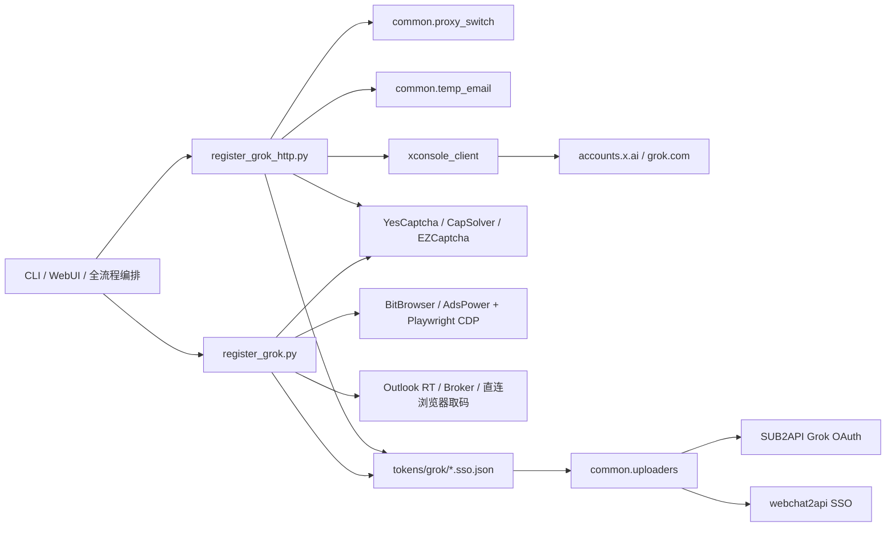

# Grok 功能架构

## 总体链路

## 两套注册实现

| 维度 | HTTP 主流程 | 浏览器兼容流程 |
|---|---|---|
| 入口 | `register_grok_http.py` | `register_grok.py` |
| 默认使用位置 | WebUI、三平台编排、独立 CLI | 手动运行及兼容路径 |
| 页面驱动 | 无浏览器 | BitBrowser/AdsPower + Playwright |
| 协议 | gRPC-web + Next.js server action | 页面表单、CDP、浏览器 Cookie |
| 邮箱 | 临时邮箱 API | 指定邮箱、Outlook 池、Graph RT、临时邮箱 |
| 验证码 | 字符串直传 gRPC | 页面输入，失败时可转协议流程 |
| CF/Turnstile | curl_cffi 指纹 + 打码 | 浏览器 clearance、人机点击、打码回退 |
| 主要产物 | Grok SSO | Grok SSO |

HTTP 版成为主流程的核心原因是 xAI 的 `XXX-XXX` 掩码验证码输入框在浏览器自动输入时容易重排字符；协议调用将验证码作为字符串提交，避开了输入控件行为。

## 核心模块职责

| 模块 | 职责 |
|---|---|
| `register_grok_http.py` | 节点选择、邮箱轮换、发码验码、Turnstile、建号、SSO 保存与即时导入 |
| `register_grok.py` | 浏览器注册、Outlook 预登录和取码、页面 CF 处理、协议回退 |
| `xconsole_client/` | xAI gRPC-web、RSC/server action、会话、指纹及 OAuth 协议实现 |
| `common/temp_email.py` | 多临时邮箱 provider 创建、轮询、字段映射和故障转移 |
| `common/proxy_switch.py` | Clash 节点枚举、切换、探测与预热 |
| `common/session_export.py` | 标准 SSO JSON 落盘 |
| `common/uploaders.py` | SUB2API 登录、分组校验、SSO 转 OAuth、webchat2api 注入 |
| `common/grok_oauth.py` | SUB2API 远端转换失败时，在本机通过 xAI Device Flow 兑换 OAuth |
| `common/token_upload_state.py` | 记录已上传账号，提供补传幂等性 |

## 信任边界和敏感数据

- `.env`：API key、管理端账号和代理配置。
- `tokens/grok/*.sso.json`：可用登录态，字段包含 `email`、`sso`、`ts`。
- SUB2API OAuth credentials：包含 `access_token`、`refresh_token`、`id_token` 等。
- 日志应避免打印完整 SSO、OAuth token 和邮箱管理端密码。
- `tokens/` 已由仓库忽略规则保护，只保留目录占位文件。

