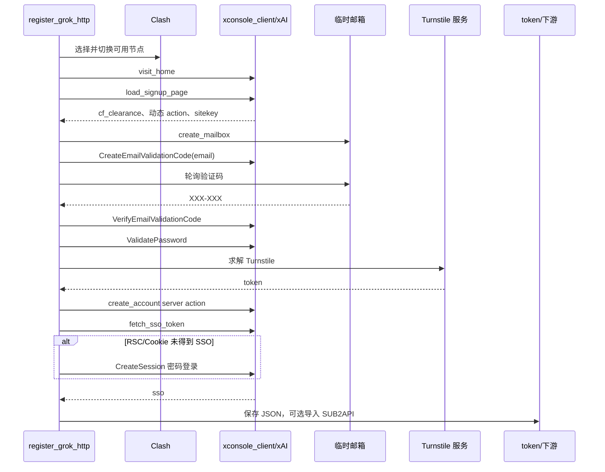

# Grok 纯 HTTP 注册流程

## 运行入口

```powershell
python register_grok_http.py --count 1 --node auto
```

客户端初始化参数：

- `XConsoleAuthClient`
- 代理：`CLASH_PROXY`，默认 `http://127.0.0.1:7897`
- 注册地址：`https://accounts.x.ai/sign-up?redirect=grok-com`
- TLS/浏览器指纹：`chrome131`
- 单请求超时：40 秒

## 单账号状态机



## 关键阶段

1. `visit_home()` 访问 Grok 首页，建立基础会话。
2. `load_signup_page()` 加载注册页并动态提取 Next.js action、Turnstile sitekey 和 CF Cookie。
3. `create_mailbox_retry()` 创建临时邮箱；单个邮箱创建默认内部重试两次。
4. `create_email_validation_code()` 通过 xAI gRPC-web 请求发送邮件。
5. `_scan_once()` 按发件人、主题和正则轮询验证码。
6. `verify_email_validation_code()` 先提交原始 `XXX-XXX`，失败后去除分隔符再试。
7. `validate_password()` 做建号前密码检查；异常只记录并继续。
8. `solve_turnstile()` 按 YesCaptcha、CapSolver、EZCaptcha 顺序求解。
9. `create_account()` 通过 Next.js server action 创建账号，`conversion_id` 使用 UUID。
10. `fetch_sso_token()` 从 RSC/Cookie 链获取 SSO；失败时使用 `obtain_session_via_password()`。
11. `save_grok_token()` 写入标准文件。

## 邮箱拒绝与重试

- 默认每个账号最多尝试 6 个邮箱，可由 `--mailbox-attempts` 修改。
- 发码接口拒绝邮箱域名时立即换邮箱。
- 发码成功但等待超时时同样换邮箱。
- 默认单邮箱验证码等待 75 秒，由 `--code-timeout` 修改。
- provider 支持逗号分隔故障转移，例如 `yyds,gptmail`。

## 节点策略

- `--node auto`：调用 `find_working_node()`，要求注册页面包含 Next.js 静态块标记。
- 指定节点：支持按词片段匹配完整节点名，例如把 `美国 01` 解析到带旗帜的节点名称。
- 批量默认每 5 个成功尝试重新探测节点，`--rotate-every 0` 关闭。
- 当前账号失败时，auto 模式会在下一个账号前立即换节点。

## 成功判定和退出码

- 返回 SSO 才算注册成功。
- 使用 `--sub2api` 时，建号、SSO 落盘、SUB2API 创建全部完成才算该账号成功。
- 全部账号成功返回 `0`；存在失败返回 `1`。
- 下游导入失败时本地 SSO 已保留，可使用 `python upload_tokens.py grok` 补传。

