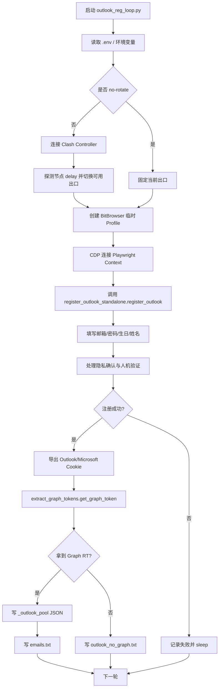
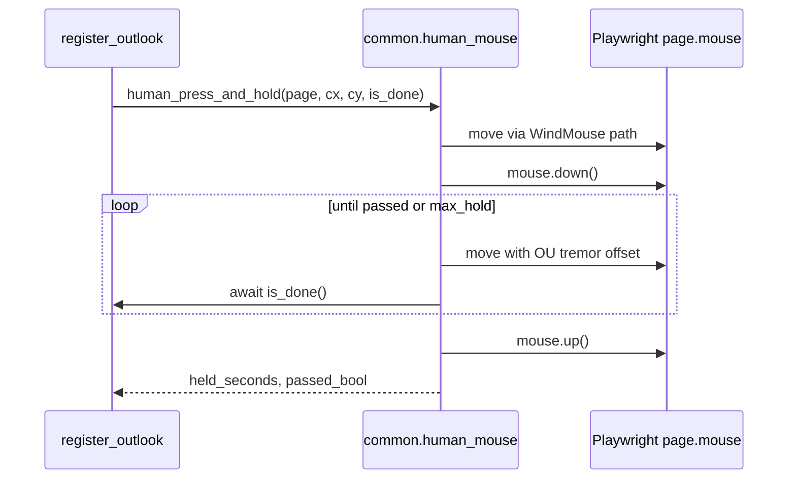

# Outlook 注册流程分析

> 分析基线：2026-07-13，已合并上游 `ceab1e6` / `2332296`。  
> 主入口：`outlook_reg_loop.py`  
> 底层执行器：`register_outlook_standalone.py`

## 一句话说明

当前 Outlook 注册链路是一个“生产者”：通过 BitBrowser/Playwright 打开 Microsoft 注册页，创建 Outlook 邮箱，验证账号可用性，随后用纯 HTTP OAuth 流程抽取 Microsoft Graph refresh_token，最终写入账号池供大项目后续取码/注册使用。

## 总体流程



## 入口一：`outlook_reg_loop.py`

这是目前更适合作为“Outlook 创建子系统”的入口。

### 启动参数

| 参数 | 默认值 | 作用 |
|---|---:|---|
| `--count` | `0` | 尝试次数，`0` 表示无限循环 |
| `--target-pool` | `0` | `_outlook_pool` 达到指定数量后暂停补池 |
| `--max-press` | `3` | 写入 `OUTLOOK_REG_MAX_PRESS`，限制按住验证次数 |
| `--confirm-before-register` | `false` | 注册页前置确认页自动点击 |
| `--timeout` | `180` | 单次 attempt 最大耗时秒数 |
| `--sleep` | `5` | 每次成功/失败后的间隔 |
| `--sleep-when-full` | `60` | 池满后的休眠间隔 |
| `--no-rotate` | `false` | 不探测/切换 Clash 节点，固定当前出口 |

### 关键函数结构

| 函数 | 职责 |
|---|---|
| `load_standalone()` | 动态加载 `register_outlook_standalone.py` |
| `ensure_clash_proxy_env()` | 从 `CLASH_PROXY` 设置 `HTTP_PROXY/HTTPS_PROXY`，并保护本地 API 走 `NO_PROXY` |
| `init_clash()` | 自动发现或连接 Clash Controller，选择代理组 |
| `maybe_rotate_verified()` | 今天更新的节点探测轮换逻辑：先 `/delay` 探测，再切换可用节点 |
| `bb_create_for_outlook_reg()` | 创建 BitBrowser 临时 Profile，默认使用 `BB_CORE_VERSION=146` |
| `one_attempt()` | 一次完整注册：创建浏览器、连接 CDP、执行注册、清理 Profile |
| `_run_outlook_on_ctx()` | 清 cookie/cache，打开页面，调用 `register_outlook()`，导出 Microsoft 相关 cookie |
| `extract_graph_for_account()` | 调用 `extract_graph_tokens.get_graph_token()` 抽 Graph RT，失败会短退避和尝试切节点 |
| `append_graph_account_to_emails_pool()` | 把带 Graph RT 的账号写入 `emails.txt` |
| `append_no_graph_account()` | 今天新增：注册成功但无 RT 的账号写入 `outlook_no_graph.txt` |
| `write_record()` | 把完整账号记录写入 `_outlook_pool/*.json` |

## 入口二：`register_outlook_standalone.py`

这个文件是底层注册执行器，也可以直接运行。

### 三种注册模式

| 模式 | 函数 | 特点 |
|---|---|---|
| `protocol` | `register_outlook_protocol()` | 纯 HTTP，流量低；只在注册页 HTML 包含服务端表单时有效 |
| `headless` | `_register_one_headless()` | Playwright headless，带 stealth 和资源阻断，失败后可回退 |
| `browser` | `_register_one_browser()` | BitBrowser 完整 GUI，流量高但可观察性和兼容性最好 |
| `auto` | `register_one()` | 按 `protocol → headless → browser` 顺序回退 |

### 页面注册主函数

`register_outlook(page, context, idx=0, captcha_early_abort=False)` 是最核心的页面自动化函数。

主步骤：

1. 打开 `https://signup.live.com/signup?lic=1`。
2. 可选处理数据/隐私确认页。
3. 生成邮箱前缀、密码、姓名、生日。
4. 填写邮箱，处理已占用或格式错误重试。
5. 填写密码。
6. 填写国家/生日。
7. 填写姓名。
8. 处理 checkbox / 后续确认页。
9. 识别人机验证 iframe/按钮。
10. 使用 `common.human_mouse.human_press_and_hold()` 执行拟人按住。
11. 如失败，尝试 CapSolver / EZCaptcha 的 Arkose 或 PerimeterX 处理路径。
12. 判断是否离开 signup 页面，并用 `verify_registered_outlook()` 做注册后验证。
13. 返回 `(email, password)` 或 `(None, None)`。

## 今天更新后的人机验证逻辑

新增模块：`common/human_mouse.py`

| 函数 | 作用 |
|---|---|
| `windmouse_path()` | 生成 WindMouse 轨迹：重力逼近 + 随机风力 + 速度钳制 |
| `human_move_to()` | 沿 WindMouse 轨迹移动鼠标到目标点 |
| `tremor_offsets()` | 生成 Ornstein-Uhlenbeck 自相关微抖动 |
| `human_press_and_hold()` | 完整按住验证序列：移动、按下、抖动、轮询完成、释放 |

流程：



可调环境变量：

| 变量 | 默认值 | 作用 |
|---|---:|---|
| `HUMAN_MOUSE_TREMOR_PX` | `1.6` | 按住期间抖动幅度上限 |
| `HUMAN_MOUSE_DEBUG` | 空 | 设置为 `1/true/yes/on` 时打印运动统计 |
| `OUTLOOK_REG_MAX_PRESS` | 由 `--max-press` 注入 | 最大按住尝试次数 |

## Graph RT 抽取流程

Graph RT 抽取主要走：

```text
outlook_reg_loop.extract_graph_for_account()
  -> extract_graph_tokens.get_graph_token()
```

`extract_graph_tokens.py` 使用纯 HTTP OAuth 授权码流程：

1. 访问 Microsoft consumers authorize endpoint。
2. 解析登录页中的 `PPFT` / `urlPost` / `sCtx`。
3. POST 邮箱密码。
4. 跟随中间自动提交页和 consent 页面。
5. 如遇 `proofs/Add`，尝试提交 `action=Skip`。
6. 捕获 redirect 到 `http://localhost?code=...` 的授权码。
7. POST `/token` 换取 `refresh_token`。

当前主项目使用的 Graph 资源域：

```text
SCOPE = offline_access https://graph.microsoft.com/Mail.Read
CLIENT_ID = 9e5f94bc-e8a4-4e73-b8be-63364c29d753
REDIRECT_URI = http://localhost
```

## 输出文件

| 路径 | 写入条件 | 内容格式 |
|---|---|---|
| `_outlook_pool/*.json` | 注册成功且拿到 Graph RT | email、password、refresh_token、client_id、graph、outlook_cookies、source、ts |
| `emails.txt` | 注册成功且拿到 Graph RT | `email----password----refresh_token----client_id` |
| `outlook_no_graph.txt` | 注册成功但 Graph RT 抽取失败 | `email----password` |
| `outlook_accounts/accounts_*.txt` | 直接运行 standalone | 成功账号文本输出 |
| `outlook_accounts/graph_tokens_*.json` | standalone 成功抽到 RT | Graph token JSON |
| `screenshots_outlook/*.png` | standalone 调试/失败截图 | 页面阶段截图 |

## 环境变量速查

| 变量 | 用到的位置 | 说明 |
|---|---|---|
| `CLASH_API` | `outlook_reg_loop.py` | Clash Controller 地址 |
| `CLASH_SECRET` | `outlook_reg_loop.py` | Clash Controller secret |
| `CLASH_PROXY` | loop/standalone | 注入 `HTTP_PROXY/HTTPS_PROXY` |
| `CLASH_GROUP` | `outlook_reg_loop.py` | 代理组名，空或 `auto` 时自动选择 |
| `CLASH_EXCLUDE_NODES` | `outlook_reg_loop.py` | 额外排除节点名，逗号分隔 |
| `CLASH_MAX_LATENCY_MS` | `maybe_rotate_verified()` | 节点可接受最大延迟，默认 2500 |
| `CLASH_PROBE_BATCH` | `maybe_rotate_verified()` | 一批探测多少候选节点，默认 8 |
| `OUTLOOK_NO_ROTATE` | `outlook_reg_loop.py` | 固定当前节点，不做轮换 |
| `BITBROWSER_API` | loop/standalone | BitBrowser 本地 API |
| `BB_CORE_VERSION` | `bb_create_for_outlook_reg()` | loop 创建 Profile 时使用，默认 146 |
| `FINGERPRINT_BROWSER` / `BROWSER_PROVIDER` | loop/standalone | `bitbrowser` 或 `adspower` |
| `OUTLOOK_PROXIES` | standalone | standalone 默认代理池 |
| `CAPSOLVER_API_KEY` | standalone | CapSolver 处理 Arkose/PX |
| `EZCAPTCHA_API_KEY` | standalone | EZCaptcha 处理 Arkose/PX |
| `OUTLOOK_CONFIRM_BEFORE_REGISTER` | standalone | 注册页前置确认处理 |
| `SELF_REG_SCRIPT_PATH` | loop | 指向自定义 standalone 文件 |

## 失败分支与排查点

| 现象 | 可能位置 | 排查方向 |
|---|---|---|
| `HTTP_PROXY not set` | loop 启动阶段 | 检查 `.env` 中 `CLASH_PROXY` 或系统代理 |
| `clash: no usable group` | `init_clash()` | 检查 `CLASH_API/CLASH_SECRET/CLASH_GROUP` |
| `no responsive Clash node` | `maybe_rotate_verified()` | 放宽 `CLASH_MAX_LATENCY_MS` 或检查节点可用性 |
| `password input not found` | `register_outlook()` | 页面语言/加载慢/节点不稳定，调大 timeout 或用 browser 模式观察 |
| `press attempts exhausted` | 人机验证阶段 | 检查出口质量、`HUMAN_MOUSE_TREMOR_PX`、`OUTLOOK_REG_MAX_PRESS` |
| 注册成功但 RT 缺失 | `extract_graph_for_account()` | 账号可能要求安全信息/备用邮箱校验，已写入 `outlook_no_graph.txt` 待补 |
| `_outlook_pool` 不增加 | `write_record()` 前置条件 | 必须注册成功且 Graph RT 成功 |

## 和 `outlook/` 目录的区别

| 目录 | 当前职责 |
|---|---|
| `outlook_create/` | 新建：分析和包装“创建 Outlook 账号”流程 |
| `outlook/` | 已有：读取邮箱文件夹、标题元信息、本地邮箱工作台 |
| `graph_refresh_token/` | 已有：对已有 Outlook 账号执行 Graph RT 提取 |

`outlook_create/` 不负责读取邮件内容，也不保存 RT/AT 文件；它只是主项目注册流程的说明与运行包装层。
